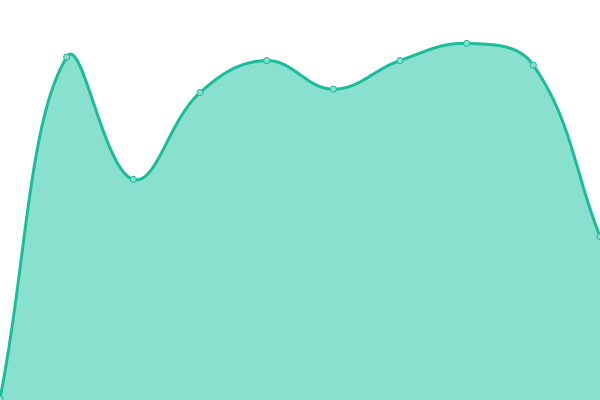
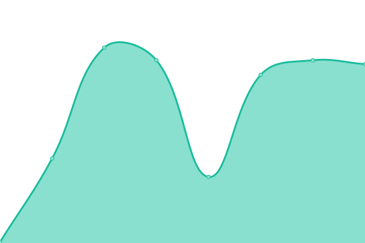

# [📈 Live Status](https://tquizzle.github.io/upptime): <!--live status--> **🟧 Partial outage**

This repository contains the open-source uptime monitor and status page for [Travis Quinnelly](https://travisq.com), powered by [Upptime](https://github.com/upptime/upptime).

With [Upptime](https://upptime.js.org), you can get your own unlimited and free uptime monitor and status page, powered entirely by a GitHub repository. We use [Issues](https://github.com/tquizzle/upptime/issues) as incident reports, [Actions](https://github.com/tquizzle/upptime/actions) as uptime monitors, and [Pages](https://tquizzle.github.io/upptime) for the status page.

<!--start: status pages-->
<!-- This summary is generated by Upptime (https://github.com/upptime/upptime) -->
<!-- Do not edit this manually, your changes will be overwritten -->
<!-- prettier-ignore -->
| URL | Status | History | Response Time | Uptime |
| --- | ------ | ------- | ------------- | ------ |
|  [TravisQ.com](https://travisq.com) | 🟩 Up | [travis-q-com.yml](https://github.com/tquizzle/upptime/commits/HEAD/history/travis-q-com.yml) | 

 134ms
     
 | 

<a href="https://upptime.travisq.com/history/travis-q-com">100.00%</a>
    

|  [Q Industries](https://qindustries.llc) | 🟩 Up | [q-industries.yml](https://github.com/tquizzle/upptime/commits/HEAD/history/q-industries.yml) | 

 247ms
     
 | 

<a href="https://upptime.travisq.com/history/q-industries">100.00%</a>
    

|  [Quinnelly.US](http://quinnelly.us) | 🟩 Up | [quinnelly-us.yml](https://github.com/tquizzle/upptime/commits/HEAD/history/quinnelly-us.yml) | 

 292ms
     
 | 

<a href="https://upptime.travisq.com/history/quinnelly-us">100.00%</a>
    

|  [vTechify](https://vtechify.com) | 🟩 Up | [v-techify.yml](https://github.com/tquizzle/upptime/commits/HEAD/history/v-techify.yml) | 

 145ms
     
 | 

<a href="https://upptime.travisq.com/history/v-techify">100.00%</a>
    

|  [Tulsa VMUG](https://community.vmug.com/communities/localcommunityhome?CommunityKey=df324546-734f-4dca-ab4f-9e67d96c753a) | 🟩 Up | [tulsa-vmug.yml](https://github.com/tquizzle/upptime/commits/HEAD/history/tulsa-vmug.yml) | 

 1628ms
     
 | 

<a href="https://upptime.travisq.com/history/tulsa-vmug">100.00%</a>
    

|  [Google](https://www.google.com) | 🟩 Up | [google.yml](https://github.com/tquizzle/upptime/commits/HEAD/history/google.yml) | 

 81ms
     
 | 

<a href="https://upptime.travisq.com/history/google">100.00%</a>
    

|  [Instagram.com](https://instagram.com) | 🟩 Up | [instagram-com.yml](https://github.com/tquizzle/upptime/commits/HEAD/history/instagram-com.yml) | 

 1029ms
     
 | 

<a href="https://upptime.travisq.com/history/instagram-com">100.00%</a>
    

|  [Wikipedia](https://en.wikipedia.org) | 🟩 Up | [wikipedia.yml](https://github.com/tquizzle/upptime/commits/HEAD/history/wikipedia.yml) | 

 119ms
     
 | 

<a href="https://upptime.travisq.com/history/wikipedia">100.00%</a>
    

|  [Hacker News](https://news.ycombinator.com) | 🟩 Up | [hacker-news.yml](https://github.com/tquizzle/upptime/commits/HEAD/history/hacker-news.yml) | 

 380ms
     
 | 

<a href="https://upptime.travisq.com/history/hacker-news">100.00%</a>
    

|  SS1 | 🟥 Down | [ss-1.yml](https://github.com/tquizzle/upptime/commits/HEAD/history/ss-1.yml) | 

 0ms
     
 | 

<a href="https://upptime.travisq.com/history/ss-1">100.00%</a>
    

<!--end: status pages-->

[**Visit our status website →**](https://tquizzle.github.io/upptime)

## 📄 License

- Powered by: [Upptime](https://github.com/upptime/upptime)
- Code: [MIT](./LICENSE) © [Travis Quinnelly](https://travisq.com)
- Data in the `./history` directory: [Open Database License](https://opendatacommons.org/licenses/odbl/1-0/)
